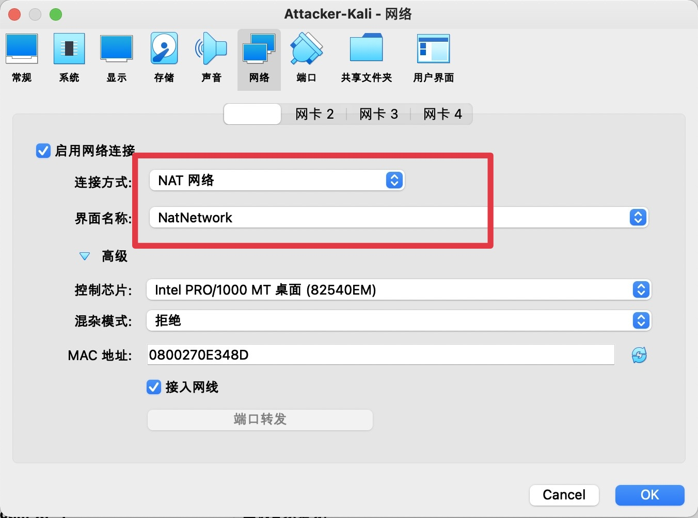

# 基于VirtualBox的网络攻防基础环境搭建


## 实验目的

- 掌握VirtualBox虚拟机的安装与使用
- 掌握VirtualBox的虚拟网络类型和按需配置
- 掌握VirtualBox的虚拟硬盘多重加载


## 实验环境

以下是本次实验需要使用的网络节点说明和主要软件举例：

- VirtualBox 虚拟机
- 攻击者主机（Attacker）：Kali Rolling 2021.2
- 网关（Gateway, GW）：Debian Buster
- 靶机（Victim）：From Sqli to shell / xp-sp3 / Kali


## 实验要求

- 虚拟硬盘配置成多重加载，效果如下图所示；

  


- 搭建满足如下拓扑图所示的虚拟机网络拓扑；

  

> 根据实验宿主机的性能条件，可以适度精简靶机数量

- 完成以下网络连通性测试；
  - ✅ 靶机可以直接访问攻击者主机
  - ✅ 攻击者主机无法直接访问靶机
  - ✅ 网关可以直接访问攻击者主机和靶机
  - ✅ 靶机的所有对外上下行流量必须经过网关
  - ✅ 所有节点均可以访问互联网


## 实验步骤

1. **虚拟机实现多重加载**

   - 在虚拟介质管理器中选中盘片进行释放，然后选择多重加载。

     

     

   - 创建实验所需机器，选择多重加载的虚拟硬盘创建

     

     

2. **配置网关主机**

   2.1配置网关主机的网卡

   - NET网络
   - Host-Only网络
   - 内部网络（intnet1）
   - 内部网络（intnet2）

   

   

   2.2配置网关转发规则（该操作实际已被老师代为完成，只是参考b站视频熟悉操作）

   - 在root用户中借助

     ```
     vi /etc/network/interfaces
     ```

     对文件进行修改，再通过命令

     ```
     /etc/init.d/networking restart
     ```

     重新启动网络

   - 配置好的网关网络详细信息如下图所示


2.3配置dnsmasq

配置dnsmasq可以实现自动获取IP地址，同时还可以实现域名解析

- 通过

  ```
  apt-get install dnsmasq
  ```

  在网关主机上安装dnsmasq

- 添加配置文件

  ```
  # /etc/dnsmasq.d/gw-enp010.conf
  interface=enp0s10
  dhcp-range=172.16.222.100,172.16.222.150,240h
  ```

  ```
  # /etc/dnsmasq.d/gw-enp09.conf
  interface=enp0s9
  dhcp-range=172.16.111.100,172.16.111.150,240h
  ```

- 修改主配置文件

  ```
  # /etc/dnsmasq.conf
  # diff dnsmasq.conf dnsmasq.conf.bak
  
  661,662c661
  < log-queries
  < log-facility=/var/log/dnsmasq.log
  ---
  > #log-queries
  665c664
  < log-dhcp
  ---
  > #log-dhcp
  ```

  

3. **配置intnet1里的靶机**

   3.1Victim-XP-1

   - 设置网络为内部网络，命名为intent1

     

   - 通过设置的dnsmasq，自动获取了正确的IP地址

     

   

   3.2Victim-Kali-1

   - 同样将网络设置为内部网络，命名为intnet1

   - 通过设置的dnsmasq，自动获取IP地址

     

     

4. **配置intnet2里的靶机**

   4.1Victim-XP-2

   - 设置内部网络，命名为intnet2

   - IP地址

     

   

   4.2Victim-Debian-2

   - 设置内部网络，命名为intnet2

   - IP地址	

     

     

5. **配置Attacker-Kali攻击者主机**

   - 设置网络为NAT网络，名称和网关的NatNetwork保持一致

     

   - IP地址

     

     

6. **连通性测试**

   以Gateway-DebianBuster、Attacker-Kali、Victim-XP-1以及Victim-Debian-2为例进行连通性测试

   6.1靶机可以直接访问攻击者主机

   

   

   

   

   6.2攻击者主机无法直接访问靶机

   ​	

   

   

   6.3网关可以直接访问攻击者与靶机

   

   

   

   

   6.4靶机的所有对外上下行流量必须经过网关

   ​	1.在网关上安装tmux和tcpdump，方便对对应网卡进行监控

   ```
   apt install tcpdump
   apt install tmux
   ```

   ​	2.利用

   ```
   tcpdump -i enp0s9 -n -w 20210907.xp.1.pcap
   ```

   ​	将输出存入数据包20210907.xp.1.pcap

   ​	

   ​	3.将数据包拷贝到主机，使用Wireshark查看分析

   

   6.5所有节点均可以访问互联网

   ​	

   


## 参考资料

- [基于 VirtualBox 的网络攻防基础环境搭建](https://c4pr1c3.github.io/cuc-ns/chap0x01/exp.html)
- [Virtualbox多重加载](https://blog.csdn.net/Jeanphorn/article/details/45056251)
- [使用adduser命令在Debian Linux中创建用户](https://blog.csdn.net/Aria_Miazzy/article/details/84790364)
- [2020-ns-public-yumlii33](https://github.com/CUCCS/2020-ns-public-yumlii33/blob/exp1/chap0x01/chap0x01.md)

